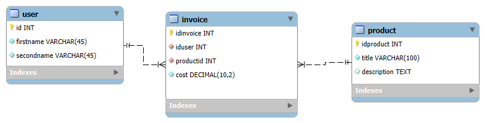
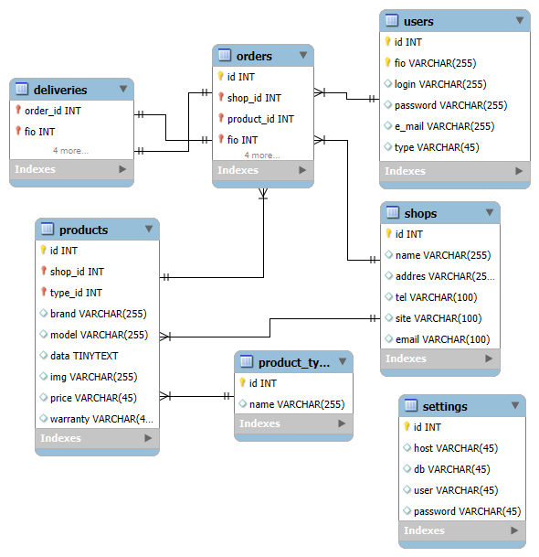
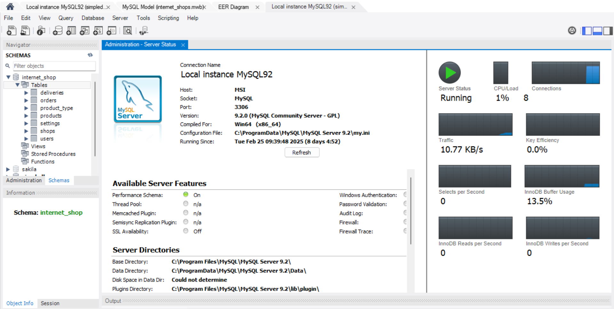
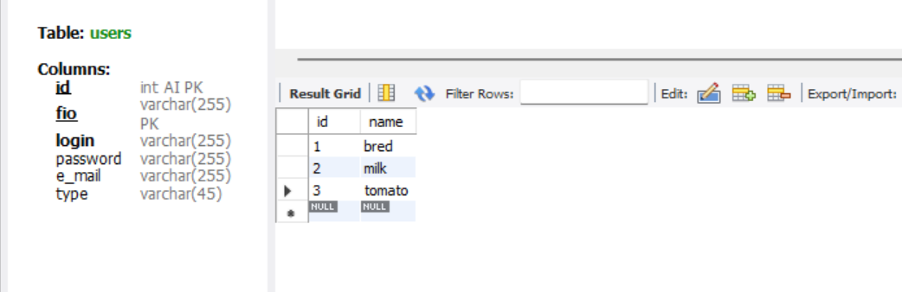
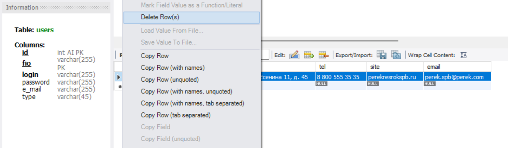
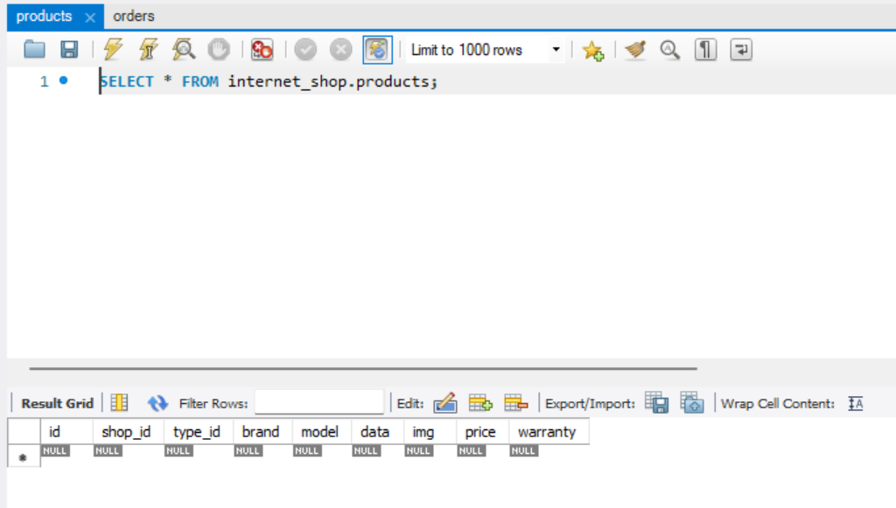
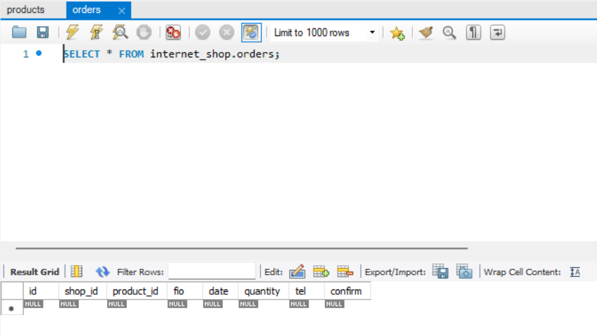

## Лабораторная работа 2
### Задание 1



Sql-запрос, соответствующий созданию этой базы данных:
```sql
-- MySQL Script generated by MySQL Workbench
-- Tue Mar  4 17:55:03 2025
-- Model: New Model    Version: 1.0
-- MySQL Workbench Forward Engineering

SET @OLD_UNIQUE_CHECKS=@@UNIQUE_CHECKS, UNIQUE_CHECKS=0;
SET @OLD_FOREIGN_KEY_CHECKS=@@FOREIGN_KEY_CHECKS, FOREIGN_KEY_CHECKS=0;
SET @OLD_SQL_MODE=@@SQL_MODE, SQL_MODE='ONLY_FULL_GROUP_BY,STRICT_TRANS_TABLES,NO_ZERO_IN_DATE,NO_ZERO_DATE,ERROR_FOR_DIVISION_BY_ZERO,NO_ENGINE_SUBSTITUTION';

-- -----------------------------------------------------
-- Schema firstModel
-- -----------------------------------------------------

-- -----------------------------------------------------
-- Schema firstModel
-- -----------------------------------------------------
CREATE SCHEMA IF NOT EXISTS `firstModel` DEFAULT CHARACTER SET utf8 ;
USE `firstModel` ;

-- -----------------------------------------------------
-- Table `firstModel`.`user`
-- -----------------------------------------------------
CREATE TABLE IF NOT EXISTS `firstModel`.`user` (
  `id` INT NOT NULL AUTO_INCREMENT,
  `firstname` VARCHAR(45) NOT NULL,
  `secondname` VARCHAR(45) NOT NULL,
  PRIMARY KEY (`id`))
ENGINE = InnoDB;


-- -----------------------------------------------------
-- Table `firstModel`.`product`
-- -----------------------------------------------------
CREATE TABLE IF NOT EXISTS `firstModel`.`product` (
  `idproduct` INT NOT NULL AUTO_INCREMENT,
  `title` VARCHAR(100) NOT NULL,
  `description` TEXT NULL,
  PRIMARY KEY (`idproduct`))
ENGINE = InnoDB;


-- -----------------------------------------------------
-- Table `firstModel`.`invoice`
-- -----------------------------------------------------
CREATE TABLE IF NOT EXISTS `firstModel`.`invoice` (
  `idinvoice` INT NOT NULL AUTO_INCREMENT,
  `iduser` INT NOT NULL,
  `productid` INT NOT NULL,
  `cost` DECIMAL(10,2) NOT NULL,
  PRIMARY KEY (`idinvoice`),
  INDEX `user_idx` (`iduser` ASC) VISIBLE,
  INDEX `prod_idx` (`productid` ASC) VISIBLE,
  CONSTRAINT `user`
    FOREIGN KEY (`iduser`)
    REFERENCES `firstModel`.`user` (`id`)
    ON DELETE CASCADE
    ON UPDATE CASCADE,
  CONSTRAINT `prod`
    FOREIGN KEY (`productid`)
    REFERENCES `firstModel`.`product` (`idproduct`)
    ON DELETE CASCADE
    ON UPDATE CASCADE)
ENGINE = InnoDB;


SET SQL_MODE=@OLD_SQL_MODE;
SET FOREIGN_KEY_CHECKS=@OLD_FOREIGN_KEY_CHECKS;
SET UNIQUE_CHECKS=@OLD_UNIQUE_CHECKS;
``` 


Запрос, касающийся создания и настройки таблицы invoice:
```sql
-- -----------------------------------------------------
-- Table `firstModel`.`invoice`
-- -----------------------------------------------------
CREATE TABLE IF NOT EXISTS `firstModel`.`invoice` (
  `idinvoice` INT NOT NULL AUTO_INCREMENT,
  `iduser` INT NOT NULL,
  `productid` INT NOT NULL,
  `cost` DECIMAL(10,2) NOT NULL,
  PRIMARY KEY (`idinvoice`),
  INDEX `user_idx` (`iduser` ASC) VISIBLE,
  INDEX `prod_idx` (`productid` ASC) VISIBLE,
  CONSTRAINT `user`
    FOREIGN KEY (`iduser`)
    REFERENCES `firstModel`.`user` (`id`)
    ON DELETE CASCADE
    ON UPDATE CASCADE,
  CONSTRAINT `prod`
    FOREIGN KEY (`productid`)
    REFERENCES `firstModel`.`product` (`idproduct`)
    ON DELETE CASCADE
    ON UPDATE CASCADE)
ENGINE = InnoDB;
```
### Задание 2


Sql-запрос, соответствующий созданию этой базы данных:
```sql
-- MySQL Script generated by MySQL Workbench
-- Wed Mar  5 12:37:46 2025
-- Model: New Model    Version: 1.0
-- MySQL Workbench Forward Engineering

SET @OLD_UNIQUE_CHECKS=@@UNIQUE_CHECKS, UNIQUE_CHECKS=0;
SET @OLD_FOREIGN_KEY_CHECKS=@@FOREIGN_KEY_CHECKS, FOREIGN_KEY_CHECKS=0;
SET @OLD_SQL_MODE=@@SQL_MODE, SQL_MODE='ONLY_FULL_GROUP_BY,STRICT_TRANS_TABLES,NO_ZERO_IN_DATE,NO_ZERO_DATE,ERROR_FOR_DIVISION_BY_ZERO,NO_ENGINE_SUBSTITUTION';

-- -----------------------------------------------------
-- Schema internet_shop
-- -----------------------------------------------------

-- -----------------------------------------------------
-- Schema internet_shop
-- -----------------------------------------------------
CREATE SCHEMA IF NOT EXISTS `internet_shop` DEFAULT CHARACTER SET utf8 ;
USE `internet_shop` ;

-- -----------------------------------------------------
-- Table `internet_shop`.`users`
-- -----------------------------------------------------
CREATE TABLE IF NOT EXISTS `internet_shop`.`users` (
  `id` INT NOT NULL AUTO_INCREMENT,
  `fio` VARCHAR(255) NOT NULL,
  `login` VARCHAR(255) NULL,
  `password` VARCHAR(255) NULL,
  `e_mail` VARCHAR(255) NULL,
  `type` VARCHAR(45) NULL,
  PRIMARY KEY (`id`, `fio`),
  UNIQUE INDEX `id_UNIQUE` (`id` ASC) VISIBLE,
  UNIQUE INDEX `login_UNIQUE` (`login` ASC) VISIBLE)
ENGINE = InnoDB;


-- -----------------------------------------------------
-- Table `internet_shop`.`settings`
-- -----------------------------------------------------
CREATE TABLE IF NOT EXISTS `internet_shop`.`settings` (
  `id` INT NOT NULL,
  `host` VARCHAR(45) NULL,
  `db` VARCHAR(45) NULL,
  `user` VARCHAR(45) NULL,
  `password` VARCHAR(45) NULL,
  PRIMARY KEY (`id`),
  UNIQUE INDEX `id_UNIQUE` (`id` ASC) VISIBLE)
ENGINE = InnoDB;


-- -----------------------------------------------------
-- Table `internet_shop`.`shops`
-- -----------------------------------------------------
CREATE TABLE IF NOT EXISTS `internet_shop`.`shops` (
  `id` INT NOT NULL,
  `name` VARCHAR(255) NULL,
  `addres` VARCHAR(255) NULL,
  `tel` VARCHAR(100) NULL,
  `site` VARCHAR(100) NULL,
  `email` VARCHAR(100) NULL,
  PRIMARY KEY (`id`),
  UNIQUE INDEX `id_UNIQUE` (`id` ASC) VISIBLE)
ENGINE = InnoDB;


-- -----------------------------------------------------
-- Table `internet_shop`.`product_type`
-- -----------------------------------------------------
CREATE TABLE IF NOT EXISTS `internet_shop`.`product_type` (
  `id` INT NOT NULL AUTO_INCREMENT,
  `name` VARCHAR(255) NULL,
  PRIMARY KEY (`id`),
  UNIQUE INDEX `id_UNIQUE` (`id` ASC) VISIBLE,
  UNIQUE INDEX `name_UNIQUE` (`name` ASC) VISIBLE)
ENGINE = InnoDB;


-- -----------------------------------------------------
-- Table `internet_shop`.`products`
-- -----------------------------------------------------
CREATE TABLE IF NOT EXISTS `internet_shop`.`products` (
  `id` INT NOT NULL AUTO_INCREMENT,
  `shop_id` INT NOT NULL,
  `type_id` INT NOT NULL,
  `brand` VARCHAR(255) NULL,
  `model` VARCHAR(255) NULL,
  `data` TINYTEXT NULL,
  `img` VARCHAR(255) NULL,
  `price` VARCHAR(45) NULL,
  `warranty` VARCHAR(45) NULL,
  PRIMARY KEY (`id`, `shop_id`, `type_id`),
  UNIQUE INDEX `id_UNIQUE` (`id` ASC) VISIBLE,
  INDEX `product_to_type_idx` (`type_id` ASC) VISIBLE,
  INDEX `shop_to_product_idx` (`shop_id` ASC) VISIBLE,
  CONSTRAINT `product_to_type`
    FOREIGN KEY (`type_id`)
    REFERENCES `internet_shop`.`product_type` (`id`)
    ON DELETE NO ACTION
    ON UPDATE NO ACTION,
  CONSTRAINT `shop_to_product`
    FOREIGN KEY (`shop_id`)
    REFERENCES `internet_shop`.`shops` (`id`)
    ON DELETE NO ACTION
    ON UPDATE NO ACTION)
ENGINE = InnoDB;


-- -----------------------------------------------------
-- Table `internet_shop`.`orders`
-- -----------------------------------------------------
CREATE TABLE IF NOT EXISTS `internet_shop`.`orders` (
  `id` INT NOT NULL AUTO_INCREMENT,
  `shop_id` INT NOT NULL,
  `product_id` INT NOT NULL,
  `fio` INT NOT NULL,
  `date` DATE NULL,
  `quantity` INT NULL,
  `tel` VARCHAR(100) NULL,
  `confirm` TINYINT NULL,
  PRIMARY KEY (`id`, `shop_id`, `product_id`, `fio`),
  UNIQUE INDEX `id_UNIQUE` (`id` ASC) VISIBLE,
  INDEX `orders_to_users_idx` (`fio` ASC) VISIBLE,
  INDEX `orders_to_product_idx` (`product_id` ASC) VISIBLE,
  INDEX `orders_to_shop_idx` (`shop_id` ASC) VISIBLE,
  CONSTRAINT `orders_to_users`
    FOREIGN KEY (`fio`)
    REFERENCES `internet_shop`.`users` (`id`)
    ON DELETE NO ACTION
    ON UPDATE NO ACTION,
  CONSTRAINT `orders_to_product`
    FOREIGN KEY (`product_id`)
    REFERENCES `internet_shop`.`products` (`id`)
    ON DELETE NO ACTION
    ON UPDATE NO ACTION,
  CONSTRAINT `orders_to_shop`
    FOREIGN KEY (`shop_id`)
    REFERENCES `internet_shop`.`shops` (`id`)
    ON DELETE NO ACTION
    ON UPDATE NO ACTION)
ENGINE = InnoDB;


-- -----------------------------------------------------
-- Table `internet_shop`.`deliveries`
-- -----------------------------------------------------
CREATE TABLE IF NOT EXISTS `internet_shop`.`deliveries` (
  `order_id` INT NOT NULL AUTO_INCREMENT,
  `fio` INT NOT NULL,
  `address` VARCHAR(255) NULL,
  `time` VARCHAR(45) NULL,
  `date` DATE NULL,
  `confirm` TINYINT NULL,
  PRIMARY KEY (`order_id`, `fio`),
  UNIQUE INDEX `order_id_UNIQUE` (`order_id` ASC) VISIBLE,
  INDEX `deliveries_to_orders_fio_idx` (`fio` ASC) VISIBLE,
  CONSTRAINT `deliveries_to_orders_fio`
    FOREIGN KEY (`fio`)
    REFERENCES `internet_shop`.`orders` (`fio`)
    ON DELETE NO ACTION
    ON UPDATE NO ACTION,
  CONSTRAINT `deliveries_to_orders_id`
    FOREIGN KEY (`order_id`)
    REFERENCES `internet_shop`.`orders` (`id`)
    ON DELETE NO ACTION
    ON UPDATE NO ACTION)
ENGINE = InnoDB;


SET SQL_MODE=@OLD_SQL_MODE;
SET FOREIGN_KEY_CHECKS=@OLD_FOREIGN_KEY_CHECKS;
SET UNIQUE_CHECKS=@OLD_UNIQUE_CHECKS;
```

Sql-запрос, соответствующий созданию тыблицы Orders:
```sql
-- -----------------------------------------------------
-- Table `internet_shop`.`orders`
-- -----------------------------------------------------
CREATE TABLE IF NOT EXISTS `internet_shop`.`orders` (
  `id` INT NOT NULL AUTO_INCREMENT,
  `shop_id` INT NOT NULL,
  `product_id` INT NOT NULL,
  `fio` INT NOT NULL,
  `date` DATE NULL,
  `quantity` INT NULL,
  `tel` VARCHAR(100) NULL,
  `confirm` TINYINT NULL,
  PRIMARY KEY (`id`, `shop_id`, `product_id`, `fio`),
  UNIQUE INDEX `id_UNIQUE` (`id` ASC) VISIBLE,
  INDEX `orders_to_users_idx` (`fio` ASC) VISIBLE,
  INDEX `orders_to_product_idx` (`product_id` ASC) VISIBLE,
  INDEX `orders_to_shop_idx` (`shop_id` ASC) VISIBLE,
  CONSTRAINT `orders_to_users`
    FOREIGN KEY (`fio`)
    REFERENCES `internet_shop`.`users` (`id`)
    ON DELETE NO ACTION
    ON UPDATE NO ACTION,
  CONSTRAINT `orders_to_product`
    FOREIGN KEY (`product_id`)
    REFERENCES `internet_shop`.`products` (`id`)
    ON DELETE NO ACTION
    ON UPDATE NO ACTION,
  CONSTRAINT `orders_to_shop`
    FOREIGN KEY (`shop_id`)
    REFERENCES `internet_shop`.`shops` (`id`)
    ON DELETE NO ACTION
    ON UPDATE NO ACTION)
ENGINE = InnoDB;
```
### Задание 3



### Задание 4

Добавлять данные в таблицы нужно поочередно, сначала в ту таблицу, 
которая не связывает свои ключи с ключами другой таблицы. Чтобы не было ошибки зависимости между ними.

Например, сначала заполнить таблицу user, product_type, shops. После чего
можно заполнять остальные таблицы, зависящие от этих 




Если удалить связанные в нескольких таблицах данные, то они удаляться из обоих источников
Например, удалим строку 1-го id из таблицы shops.

В таблицах products и orders удалились строки в соответствующим id

